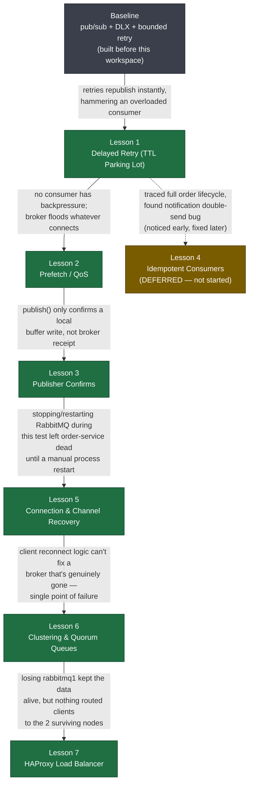

# Learning Journey: RabbitMQ Microservice Demo

How each lesson came to exist: the problem that surfaced, what it taught, and how that
in turn exposed the next problem. See [MISSION.md](MISSION.md) for the overall goal
and `learning-records/` for detailed moments of understanding.

## The chain, as a graph

Nearly every lesson here wasn't planned in advance — it was pulled into scope because
testing the *previous* lesson exposed a gap. The graph below shows that causality:
solid arrows are "this problem led to this lesson"; the dashed arrow is a problem that
was noticed early but deliberately parked.

## Step by step

### Baseline — pub/sub + DLX + bounded retry
**Already in place before this teaching workspace started.** Topic-exchange pub/sub
across independent consumer queues, durable exchanges/queues with persistent messages,
manual ack/nack, and a bounded retry loop keyed off the `x-death` header count.

### Lesson 1 — Delayed Retry with a TTL Parking Lot
- **Problem encountered:** the existing retry loop worked, but every retry
  republished *instantly*. If `inventory-service` was failing because it was
  overloaded, zero-delay retries just added to the pile instead of giving it room to
  recover.
- **What was learned:** a queue with no consumer and an `x-message-ttl` can act as a
  delay buffer — RabbitMQ itself, not application code, moves the message onward via
  that queue's `x-dead-letter-exchange` once the TTL expires. Delay becomes a broker
  property, not something the consumer code has to implement.
- **Side effect noticed:** while tracing this flow end-to-end, spotted that
  `q.orders.notification` receives a copy on *every* retry cycle, not just the
  original order — a bug that Lesson 4 exists to fix.

### Lesson 2 — Prefetch / QoS
- **Problem encountered:** none of the consumers set a limit on `channel.consume`, so
  RabbitMQ's default behavior is to push every ready message at once regardless of
  whether the consumer has acked anything yet.
- **What was learned:** `channel.prefetch(n)` (AMQP `basic.qos`) is a *continuous*
  ceiling on unacknowledged messages, enforced one-in-one-out — not a one-time batch
  size. Verified live with a 6-order burst test against `prefetch(3)` and watched
  Ready/Unacked counts move exactly as predicted.

### Lesson 3 — Publisher Confirms
- **Problem encountered:** `channel.publish()` returns a boolean synchronously, but
  that only reflects amqplib's local write buffer — not whether RabbitMQ actually
  received and persisted the message. `order-service` was replying `201 Created`
  before knowing the broker had it at all.
- **What was learned:** `createConfirmChannel()` plus a per-publish callback gives the
  publisher the same "don't consider it handled until acked" guarantee consumers
  already had — closing the last named reliability gap (the publish side).

### Lesson 5 — Connection & Channel Recovery
- **Problem encountered:** *discovered while testing Lesson 3.* Stopping and
  restarting RabbitMQ left `order-service` completely dead until a human manually ran
  `npm start` again — `connect()` only ever ran once, at boot.
- **What was learned:** amqplib's connection is an `EventEmitter`; listening for
  `'close'`/`'error'` and re-running the full connect sequence (new connection,
  channel, re-asserted topology) turns a fatal outage into a self-healing one.
  Extended later (during Lesson 7) from `order-service` to every other service.

### Lesson 6 — Clustering & Quorum Queues
- **Problem encountered:** *discovered while testing Lesson 5.* Reconnect logic
  proved the client survives RabbitMQ going away and coming back — but nothing
  actually brings RabbitMQ itself back. One Docker container is a single point of
  failure that no amount of client-side retry can fix.
- **What was learned:** a RabbitMQ cluster shares topology across nodes, and a
  `quorum queue` (`x-queue-type: "quorum"`) replicates a queue's actual messages
  across nodes via Raft — a 3-member quorum queue survives 1 node dying. Verified
  live: `q.orders.inventory` kept its data after killing `rabbitmq1`.

### Lesson 7 — HAProxy in Front of the Cluster
- **Problem encountered:** *discovered while testing Lesson 6.* Killing `rabbitmq1`
  proved the *data* survived, but nothing was routing clients to the two nodes that
  were still healthy — no management UI, no publishing, even though 2/3 of the
  cluster was fine.
- **What was learned:** put a load balancer (HAProxy) in front of all nodes so
  clients connect to one stable address; HAProxy's active health checks decide which
  node receives each connection. Critical constraint: HAProxy must **not** run on a
  cluster node, or losing that machine takes out both a broker and the only entry
  point at once.
- **Bugs found and fixed along the way** (not lesson content, real rough edges):
  missing trailing newline crashing HAProxy boot; leftover host port mappings on
  `rabbitmq1` conflicting with the new `haproxy` service; HAProxy failing to boot if a
  backend hostname can't resolve (start RabbitMQ nodes before HAProxy); default 30s
  HAProxy timeouts shorter than RabbitMQ's 60s AMQP heartbeat causing an infinite
  reconnect-flap loop (fixed by bumping both to 3m).

### Lesson 4 — Idempotent Consumers *(deferred)*
- **Problem it targets:** the notification double-send bug noticed back in Lesson 1 —
  RabbitMQ guarantees *at-least-once* delivery, never exactly-once, so both the
  parking-lot retry and ordinary crash-before-ack redelivery produce duplicates that
  the consumer itself must be able to absorb safely.
- **Status:** intentionally paused after Lesson 7 — a deliberate choice, not a
  forgotten item. Resume when it comes back up.

## Recurring pattern worth naming

Every "why" above except Lesson 1 and Lesson 2 came from *live-testing the previous
fix* and noticing its edge, not from a pre-written curriculum:

- Lesson 3 → Lesson 5: confirms didn't cover what happens when the whole connection
  dies mid-test.
- Lesson 5 → Lesson 6: reconnect logic doesn't help if nothing restarts the broker
  itself.
- Lesson 6 → Lesson 7: surviving nodes are useless if nothing routes clients to them.

Reliability here kept turning out to live in layers — publish, consume, connection,
broker, routing — and each lesson closed exactly one layer before the next one's gap
became visible.
