# Learning Journey: Redis & Rate Limiting

How each lesson came to exist: the problem that surfaced, what it taught, and how that
in turn exposed the next problem. See [MISSION.md](MISSION.md) for the overall goal and
`learning-records/` for detailed moments of understanding.

## The chain, as a graph

Most of this chain was pulled into scope by testing or reviewing the *previous* lesson
and hitting its edge — not planned in advance. The two exceptions are the pivot from
rate limiting to caching (a deliberate phase change named in `MISSION.md`, not a bug) and
the very first step, which is a restart rather than a forward step: the original
attempt at client wiring exposed that "OK understanding of Redis" didn't cover the
fundamentals it needed to.

```mermaid
flowchart TD
    B["Baseline\nSelf-reported 'OK understanding'\nof Redis, unverified"]
    A0["Attempt: client wiring\nredisClient written as a factory\nfunction — connect()/build() confused"]

    L1["Lesson 1\nRedis Fundamentals (redis-cli only)"]
    L2["Lesson 2\nClient Wiring (gateway)"]
    L3["Lesson 3\nFixed-Window Rate Limiter"]
    L4["Lesson 4\nSliding-Window Rate Limiter\n(sorted sets)"]
    L5["Lesson 5\nToken Bucket\n(Lua EVAL script)"]
    L6["Lesson 6\nLimiter Factory\n(closures)"]
    L7["Lesson 7\nCache-Aside\n(inventory-service)"]
    L8["Lesson 8\nSingle-Flight Locking\n(cache stampede)"]
    L9["Lesson 9\nWrite-Path Invalidation\n(order-service)"]

    B --> A0
    A0 -- "construct-vs-connect model\nwasn't actually solid" --> L1
    L1 -- "fundamentals-only, no service\nto wire yet" --> L2
    L2 -- "debug route does the mechanics\nbut never rejects anything" --> L3
    L3 -- "client can send up to 2x MAX\nby timing a window boundary" --> L4
    L4 -- "one ZSET member per request —\never-churning state for steady traffic" --> L5
    L5 -- "3 limiters, each hardcodes its\nroute name + tuning constants" --> L6
    L6 -- "rate-limiting arc closed;\nMISSION's next phase pivots to caching" --> L7
    L7 -- "concurrent misses on the same key\nall recompute independently" --> L8
    L8 -- "ported to order-service — but\naddOrder() actually mutates the\ncached data, unlike inventory" --> L9

    classDef done fill:#1f6f43,stroke:#0d3d24,color:#fff
    classDef base fill:#3a3f4b,stroke:#1c1f26,color:#fff
    class B,A0 base
    class L1,L2,L3,L4,L5,L6,L7,L8,L9 done
```

## Step by step

### Baseline — "OK understanding of Redis," unverified
Self-reported going in, specifically motivated by wanting to learn **rate limiting** —
narrower than "learn Redis" in general. First reaction to "rate limiting algorithms" was
"what are algorithms?", suggesting the algorithm-level vocabulary (fixed window / sliding
window / token bucket) was new even if basic commands weren't. Basic commands
(`GET`/`SET`/`INCR`/`EXPIRE`/`TTL`) turned out to genuinely already be familiar — what
wasn't was the connection *model*.

### Attempt: client wiring — exposed the real gap
- **Problem encountered:** writing `gateway/src/redis/client.ts` for the first time,
  `redisClient` came out as a factory function that built a client and threw it away
  each call, then called `.connect()` on the function itself rather than on a client
  instance.
- **What it revealed:** this wasn't a TypeScript slip — it was evidence the "OK
  understanding" baseline didn't include the core model of Redis as a separate server
  your app opens **one shared connection** to, with "construct the client" and "connect
  the client" as two distinct steps. That gap gets learned once, correctly, or it
  quietly breaks everything built on top of it.

### Lesson 1 — Redis Fundamentals (redis-cli only)
- **Problem encountered:** *the attempt above.* Skipping straight to code let a
  fundamentals gap hide inside a syntax-shaped mistake.
- **What was learned:** what Redis fundamentally is (in-memory data structure store, a
  separate server reached over TCP), using nothing but `redis-cli` typed directly into a
  terminal — no files, no client library, no way to paper over the model with code you
  don't fully understand yet.

### Lesson 2 — Client Wiring (gateway)
- **Problem encountered:** `docker-compose.yml` and `gateway/.env` were already set up
  for Redis, but nothing in `gateway` actually talked to it yet.
- **What was learned:** the same construct-vs-connect wiring Lesson 1 built intuition
  for, now written correctly in TypeScript — one shared client, constructed once,
  connected once, reused everywhere.

### Lesson 3 — Fixed-Window Rate Limiter
- **Problem encountered:** Lesson 2's debug route already did the entire mechanical core
  of fixed-window limiting (`SET ... NX EX` to start a window once, `INCR` to count
  within it) — it just never rejected anything, always returning 200 regardless of count.
- **What was learned:** turning that mechanism into real Express middleware, mounted in
  front of `POST /api/v1/orders`, that actually returns `429` once a client exceeds
  `MAX_REQUESTS` in the current window.

### Lesson 4 — Sliding-Window Rate Limiter (sorted sets)
- **Problem encountered:** *discovered while testing/verifying Lesson 3.* A client
  timing its bursts around a window boundary could send up to 2x `MAX_REQUESTS` in a
  short span, because each fixed window only ever enforces its own count in isolation.
- **What was learned:** replacing the single counter with a Redis sorted set — one
  member per request, scored by timestamp — lets the limiter answer "how many requests
  in the last N seconds, as of right now," a strictly stronger question than "how many
  requests in whatever window happens to be open."

### Lesson 5 — Token Bucket (Lua `EVAL` script)
- **Problem encountered:** sliding window fixed the boundary-burst flaw, but at a real
  cost — one ZSET member per request means a client sending steadily for an hour builds
  an ever-churning set of timestamps that has to be maintained forever.
- **What was learned:** token bucket gets the same "smooth over time" property with
  constant state per client (just a token count and a timestamp), but the
  read-compute-write has to be atomic in a way plain `MULTI` can't express (can't branch
  on a value read mid-transaction) — the first lesson to introduce Redis scripting via
  `EVAL`.

### Lesson 6 — Limiter Factory (closures)
- **Problem encountered:** *noticed while looking back across all three limiters built so
  far.* `rateLimiter.ts`, `slidingWindowRateLimiter.ts`, and `tokenBucketRateLimiter.ts`
  all hardcoded their Redis key, route name, and tuning constants directly in the module
  — exactly one middleware, wired to exactly one route. Adding rate limiting to a second
  route would mean copy-pasting an entire file and hand-editing the copy.
- **What was learned:** `createTokenBucketLimiter(config)` — a factory that takes
  `{ scope, capacity, refillPerSecond }` and returns a middleware closed over that
  config, so a second rate-limited route is a function call, not a file copy. Applying
  the same refactor to the other two limiters was left as an optional, not-required
  follow-up.

### Lesson 7 — Cache-Aside (inventory-service)
- **Not a discovered problem — a deliberate pivot.** The rate-limiting arc was closed;
  `MISSION.md`'s "next phase" named Redis-as-a-cache as the next applied problem ahead of
  time, not something testing exposed.
- **What was learned:** the cache-aside pattern (check cache → hit returns immediately →
  miss reads the real source, writes it back with a TTL, returns it) applied to
  `inventory-service`'s stock read, with TTL-only invalidation — justified specifically
  because nothing in the codebase mutated `stock` on order placement at the time.

### Lesson 8 — Single-Flight Locking (cache stampede prevention)
- **Problem encountered:** *surfaced by discussing what happens under load, right after
  Lesson 7 was reviewed.* Cache-aside has no coordination between callers — if many
  requests hit a miss on the same key at once (most likely the instant a TTL expires),
  every one of them independently recomputes and rewrites the same value.
- **What was learned:** `SET ... NX` as an atomic "claim this work" primitive, paired
  with a `PX` TTL as a crash-safety net, turns N redundant recomputes into exactly one —
  the rest poll the cache and read the winner's result, falling back to an uncached
  direct read only if the winner is unexpectedly slow.
- **Bugs found and fixed along the way** (not lesson content, real rough edges): the
  lock's `PX` value was first wired to the wrong constant (the retry-poll interval
  instead of the lock's own TTL, making the lock expire almost immediately); the fix for
  that then swapped `PX` for `EX` while keeping the same numeric value, turning a 2-second
  lock into a ~33-minute one; a separate edit aimed at the lock's TTL landed on the
  *cache entry's* TTL instead, briefly giving the cached stock value a 10-millisecond
  lifespan. Verified correct afterward with real concurrent `curl` requests (a
  sequential Postman "click send repeatedly" test doesn't exercise this at all — nothing
  overlaps in time).
- **Left open, not fixed:** the lock's `del()` release is unconditional, so it could in
  theory delete a different request's lock if this one's TTL expired first. The fully
  correct version would use node-redis's `delEx` compare-and-delete with a per-request
  lock value — flagged as a known gap, not required for this exercise.

### Lesson 9 — Write-Path Invalidation (order-service)
- **Problem encountered:** *discovered while porting Lessons 7-8's cache-aside + lock
  shape onto a second service.* Lesson 7's TTL-only justification for inventory
  ("nothing mutates `stock` on order placement") doesn't transfer — `addOrder()` mutates
  the orders list on every successful `POST /orders`, so left as TTL-only, a freshly
  placed order would be invisible from `GET /orders` for up to 10 seconds.
- **What was learned:** active invalidation on write — deleting the cache key the
  instant the underlying data changes, from the route layer (right after `addOrder()`
  confirms), not from `data.ts` itself, which stays cache-unaware as the source of
  truth. Framed explicitly as the lazy-TTL-vs-active-invalidation trade-off, and why
  cache invalidation has a reputation as a hard problem: not the mechanism (one line,
  `del()`), but making sure every write path that touches cached data actually calls it.

## Recurring pattern worth naming

Every lesson from 3 onward except the Lesson 6-to-7 pivot came from *using or reviewing
the previous lesson* and hitting its edge, not from a pre-written curriculum:

- Lesson 3 → Lesson 4: fixed windows have a boundary the client can exploit.
- Lesson 4 → Lesson 5: sliding window fixes that, but its per-request state cost is
  unbounded over time.
- Lesson 5 → Lesson 6: three working limiters, all hardcoded to one route each — a
  duplication smell noticed only once there were three to compare.
- Lesson 7 → Lesson 8: caching one read raised the question "what if many requests miss
  at once?" — not something Lesson 7 alone would have surfaced without asking it.
- Lesson 8 → Lesson 9: the same shape, applied to a second service, broke an assumption
  (no write-path mutation) that was only ever true for the *first* service.

The rate-limiting arc kept turning out to live in layers — count, then smooth the count
over time, then stop hardcoding what's being counted. The caching arc's layers were
different: make it fast (Lesson 7), make it safe under concurrency (Lesson 8), make it
correct under writes (Lesson 9). Both arcs got harder in the same direction: each lesson
didn't just add a feature, it removed an assumption the previous one was quietly relying
on.
