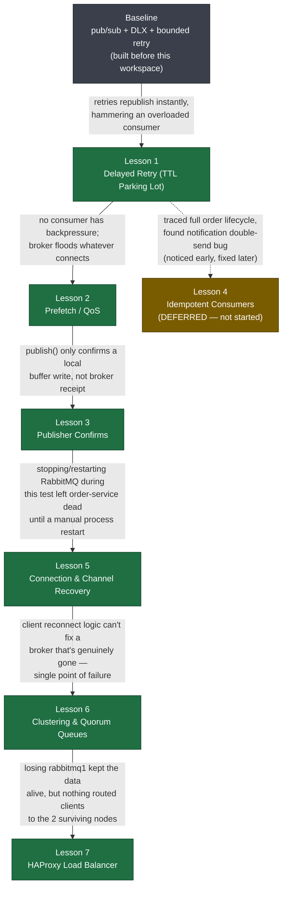

# RabbitMQ Microservice Demo

An order → inventory/notification → dead-letter pipeline over RabbitMQ, used as a
hands-on vehicle for learning production-grade messaging patterns one at a time. See
[MISSION.md](MISSION.md) for the full goal and scope.

## Services

- **gateway** — entry point
- **order-service** — places orders, publishes `order.placed` with publisher confirms
- **inventory-service** — consumes orders with prefetch-controlled backpressure
- **notification-service** — sends order confirmations
- **dead-letter-service** — handles failures, bounded + delayed retry via a TTL parking lot

All services connect through **HAProxy** to a 3-node RabbitMQ **cluster** using
**quorum queues**, and self-heal their connections on broker restarts.

## Learning journey

Nearly every lesson below wasn't planned in advance — it was pulled into scope because
live-testing the *previous* lesson exposed a gap. Full write-up with the problem and
takeaway for each step: **[JOURNEY.md](JOURNEY.md)**.



| Lesson | Topic | Status |
|---|---|---|
| 1 | [Delayed Retry (TTL Parking Lot)](lessons/0001-delayed-retry-ttl-parking-lot.html) | Done |
| 2 | [Prefetch / QoS](lessons/0002-prefetch-qos.html) | Done |
| 3 | [Publisher Confirms](lessons/0003-publisher-confirms.html) | Done |
| 4 | [Idempotent Consumers](lessons/0004-idempotent-consumers.html) | Deferred |
| 5 | [Connection & Channel Recovery](lessons/0005-connection-recovery.html) | Done |
| 6 | [Clustering & Quorum Queues](lessons/0006-clustering-quorum-queues.html) | Done |
| 7 | [HAProxy Load Balancer](lessons/0007-haproxy-load-balancer.html) | Done |

## Other docs

- [MISSION.md](MISSION.md) — goal, success criteria, scope
- [ROUTES.md](ROUTES.md) — API routes
- [GLOSSARY.md](GLOSSARY.md) — terms introduced along the way
- [RESOURCES.md](RESOURCES.md) — primary sources per lesson

## Running it

```
docker compose up -d
npm start
```
