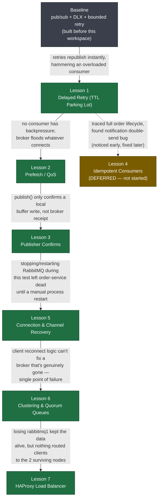

# RabbitMQ Microservice Demo

An order → inventory/notification → dead-letter pipeline over RabbitMQ, used as a
hands-on vehicle for learning production-grade messaging patterns one at a time. See
[MISSION.md](Learning/rabbitMQ_learning/MISSION.md) for the full goal and scope.

Learning docs live in two folders, one per track: **[rabbitMQ_learning/](Learning/rabbitMQ_learning/)**
and **[redis_learning/](Learning/redis_learning/)** (started once the RabbitMQ arc below
wrapped up — see [redis_learning/MISSION.md](Learning/redis_learning/MISSION.md)).

## Services

- **gateway** — entry point
- **order-service** — places orders, publishes `order.placed` with publisher confirms
- **inventory-service** — consumes orders with prefetch-controlled backpressure
- **notification-service** — sends order confirmations
- **dead-letter-service** — handles failures, bounded + delayed retry via a TTL parking lot

All services connect through **HAProxy** to a 3-node RabbitMQ **cluster** using
**quorum queues**, and self-heal their connections on broker restarts.

## Learning journey

Nearly every lesson below wasn't planned in advance — it was pulled into scope because
live-testing the *previous* lesson exposed a gap. Full write-up with the problem and
takeaway for each step: **[JOURNEY.md](Learning/rabbitMQ_learning/JOURNEY.md)**. Also see the
**[Udemy course checklist](Learning/rabbitMQ_learning/rabbitmq-course-checklist.html)** for what's
covered vs. still missing against an outside curriculum.



| Lesson | Topic | Status |
|---|---|---|
| 1 | [Delayed Retry (TTL Parking Lot)](Learning/rabbitMQ_learning/lessons/0001-delayed-retry-ttl-parking-lot.html) | Done |
| 2 | [Prefetch / QoS](Learning/rabbitMQ_learning/lessons/0002-prefetch-qos.html) | Done |
| 3 | [Publisher Confirms](Learning/rabbitMQ_learning/lessons/0003-publisher-confirms.html) | Done |
| 4 | [Idempotent Consumers](Learning/rabbitMQ_learning/lessons/0004-idempotent-consumers.html) | Deferred |
| 5 | [Connection & Channel Recovery](Learning/rabbitMQ_learning/lessons/0005-connection-recovery.html) | Done |
| 6 | [Clustering & Quorum Queues](Learning/rabbitMQ_learning/lessons/0006-clustering-quorum-queues.html) | Done |
| 7 | [HAProxy Load Balancer](Learning/rabbitMQ_learning/lessons/0007-haproxy-load-balancer.html) | Done |

## Redis learning journey

A second, separate track (own folder, own lesson numbering) started once the RabbitMQ
arc above wrapped up — rate limiting first, then caching, both against `redis`. Full
write-up: **[redis_learning/JOURNEY.md](Learning/redis_learning/JOURNEY.md)**.

```mermaid
flowchart TD
    B["Baseline\nSelf-reported 'OK understanding'\nof Redis, unverified"]
    A0["Attempt: client wiring\nredisClient written as a factory\nfunction — connect()/build() confused"]

    L1["Lesson 1\nRedis Fundamentals (redis-cli only)"]
    L2["Lesson 2\nClient Wiring (gateway)"]
    L3["Lesson 3\nFixed-Window Rate Limiter"]
    L4["Lesson 4\nSliding-Window Rate Limiter\n(sorted sets)"]
    L5["Lesson 5\nToken Bucket\n(Lua EVAL script)"]
    L6["Lesson 6\nLimiter Factory\n(closures)"]
    L7["Lesson 7\nCache-Aside\n(inventory-service)"]
    L8["Lesson 8\nSingle-Flight Locking\n(cache stampede)"]
    L9["Lesson 9\nWrite-Path Invalidation\n(order-service)"]

    B --> A0
    A0 -- "construct-vs-connect model\nwasn't actually solid" --> L1
    L1 -- "fundamentals-only, no service\nto wire yet" --> L2
    L2 -- "debug route does the mechanics\nbut never rejects anything" --> L3
    L3 -- "client can send up to 2x MAX\nby timing a window boundary" --> L4
    L4 -- "one ZSET member per request —\never-churning state for steady traffic" --> L5
    L5 -- "3 limiters, each hardcodes its\nroute name + tuning constants" --> L6
    L6 -- "rate-limiting arc closed;\nMISSION's next phase pivots to caching" --> L7
    L7 -- "concurrent misses on the same key\nall recompute independently" --> L8
    L8 -- "ported to order-service — but\naddOrder() actually mutates the\ncached data, unlike inventory" --> L9

    classDef done fill:#1f6f43,stroke:#0d3d24,color:#fff
    classDef base fill:#3a3f4b,stroke:#1c1f26,color:#fff
    class B,A0 base
    class L1,L2,L3,L4,L5,L6,L7,L8,L9 done
```



| Lesson | Topic | Status |
|---|---|---|
| 1 | [Redis Fundamentals](Learning/redis_learning/lessons/0001-what-redis-is.html) | Done |
| 2 | [Client Wiring](Learning/redis_learning/lessons/0002-client-wiring.html) | Done |
| 3 | [Fixed-Window Rate Limiter](Learning/redis_learning/lessons/0003-fixed-window-rate-limiter.html) | Done |
| 4 | [Sliding-Window Rate Limiter](Learning/redis_learning/lessons/0004-sliding-window-sorted-sets.html) | Done |
| 5 | [Token Bucket](Learning/redis_learning/lessons/0005-token-bucket.html) | Done |
| 6 | [Limiter Factory](Learning/redis_learning/lessons/0006-limiter-factory.html) | Done |
| 7 | [Cache-Aside (inventory-service)](Learning/redis_learning/lessons/0007-cache-aside-inventory.html) | Done |
| 8 | [Single-Flight Locking](Learning/redis_learning/lessons/0008-single-flight-lock.html) | Done |
| 9 | [Write-Path Invalidation (order-service)](Learning/redis_learning/lessons/0009-write-path-invalidation.html) | Done |

## Other docs

- [MISSION.md](Learning/rabbitMQ_learning/MISSION.md) — RabbitMQ goal, success criteria, scope
- [redis_learning/MISSION.md](Learning/redis_learning/MISSION.md) — Redis goal, success criteria, scope
- [redis_learning/reference/data-types.md](Learning/redis_learning/reference/data-types.md) — Redis data types quick reference
- [ROUTES.md](ROUTES.md) — API routes
- [GLOSSARY.md](Learning/rabbitMQ_learning/GLOSSARY.md) — terms introduced along the way
- [RESOURCES.md](Learning/rabbitMQ_learning/RESOURCES.md) — primary sources per lesson

## Running it

```
docker compose up -d
npm start
```
